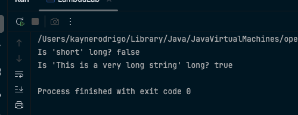
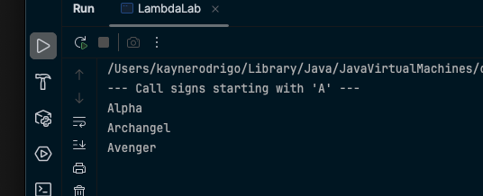
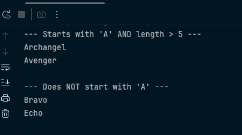

# JCExploring-LambdasAndPredicate

**Author:** Kayne Uriel Rodrigo

## Lab Overview
This repository contains the completed exercises for the "Introduction to Java Lambdas and Predicates" hands-on lab. The objective is to understand the purpose of lambda expressions and learn how to write and use simple Predicates to test data.

## Key Concepts Covered
- **Functional Interface**: Interfaces with only one abstract method (like `Predicate<T>`)
- **Lambda Expression**: Short, anonymous blocks of code that implement functional interfaces
- **Predicate Interface**: Used for testing conditions with the `test(T t)` method
- **Method Chaining**: Combining predicates using `and()`, `or()`, and `negate()`

## Exercise Screenshots

### Exercise 1: The "New Way" - A Simple Lambda Expression
*Screenshot showing the output of Exercise 1*


**Key Concepts Demonstrated:**
- Creating a `Predicate<String>` using lambda syntax: `s -> s.length() > 10`
- Understanding lambda structure: parameter `s`, arrow `->`, and expression `s.length() > 10`
- Comparing lambda conciseness vs traditional anonymous class implementation
- Testing strings with the predicate's `test()` method

---

### Exercise 3: Using Predicates to Filter a List
*Screenshot showing the output of Exercise 3*


**Key Concepts Demonstrated:**
- Creating a reusable `filterAndPrint()` method that accepts any `Predicate<String>`
- Passing lambda expressions as method arguments
- Using `s.startsWith("A")` to filter strings beginning with "A"
- Demonstrating the power of behavior parameterization
- Filtering call signs: "Alpha", "Archangel", "Avenger" should appear

---

### Exercise 4: Chaining Predicates (and, negate)
*Screenshot showing the output of Exercise 4*


**Key Concepts Demonstrated:**
- Creating multiple simple predicates: `startsWithA` and `hasLengthGreaterThan5`
- Combining predicates with `and()` method for complex conditions
- Using `negate()` method to reverse predicate logic
- Building readable, composable query logic
- Filtering with combined conditions (starts with 'A' AND length > 5)
- Negating conditions (does NOT start with 'A')

## Lambda Expression Syntax Breakdown

```java
// Basic lambda structure
s -> s.length() > 10

// Parameter: s (type inferred as String from Predicate<String>)
// Arrow: -> (separates parameter from body)
// Body: s.length() > 10 (expression that returns boolean)
```

## Predicate Method Chaining Examples

```java
// AND operation - both conditions must be true
Predicate<String> complexCondition = startsWithA.and(hasLengthGreaterThan5);

// OR operation - either condition can be true  
Predicate<String> eitherCondition = startsWithA.or(hasLengthGreaterThan5);

// NEGATE operation - reverses the boolean result
Predicate<String> doesNotStartWithA = startsWithA.negate();
```

## Lab Completion
All exercises have been completed successfully, demonstrating proficiency with:
- Lambda expression syntax and structure
- Functional interface implementation with lambdas
- Predicate creation and usage
- Method parameterization with lambda expressions
- Predicate chaining and composition
- Building reusable, flexible filtering logic

## Expected Outputs Summary

**Exercise 1:** Tests two strings ("short" and "This is a very long string") against length > 10 predicate

**Exercise 3:** Filters call signs starting with 'A' (Alpha, Archangel, Avenger)

**Exercise 4:** 
- Shows call signs starting with 'A' AND length > 5 (Archangel, Avenger)
- Shows call signs NOT starting with 'A' (Bravo, Echo)

## Instructions for Use
1. Clone this repository
2. Navigate to the project directory
3. Compile and run each exercise file to see lambda expressions and predicates in action
4. Review the screenshots to see expected outputs
5. Experiment with creating your own lambda expressions and predicate combinations

---
*This lab was completed as part of the Java Functional Programming learning module, focusing on lambda expressions and the Predicate interface.*